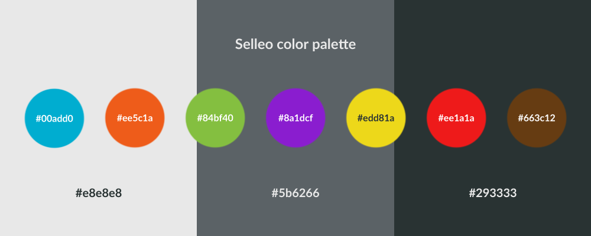

## Overview

**Selleo Resources** repository includes many variants of [selleo](http://selleo.com) logos, icons & font. 
Stick to the rules we have in our [guideline](https://www.figma.com/proto/aAZNLti1x7RHcKO2aaVdyh/Selleo-Design-System?page-id=1473%3A1928&node-id=1473%3A2058&viewport=747%2C521%2C0.06&scaling=min-zoom&starting-point-node-id=1473%3A2058). All logo files are available [here](https://drive.google.com/drive/folders/1WgNJZkQcrioRmZjp6c3ISjFNaUF9pWmz?usp=sharing)

### Colors palette

theme |   primary  | secondary |
----- | ---------- | --------- |
base  |  `#FF6D2A` | `#5C99D2` |
